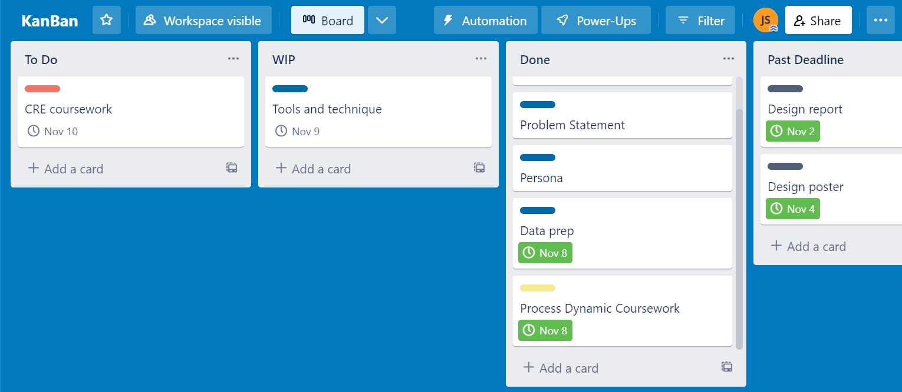

# Use of software engineering tools and techniques (coursework 1)

Use this file to provide evidence for the software engineering tools and techniques section of coursework 1.

## Source code control   

I used github as source code control. The link is here: https://github.com/ucl-comp0035/comp0035-cw-i-JocelynS371

## Progess reporting

Evidence on moodle

## Kanban  

I mentioned in project-method that I am using a kanban board to help with organisation. I am using a online board creator called Trello. The link to the board is:https://trello.com/invite/b/gPh4DxAW/ATTIff050d80af19bd038bdaae6ccc4f72868C5A5D5B/kanban. A screenshot to the board looks like:  

There is 4 section rather than 3 in the tradditional set up because when I only had 3, the task fill up the done column and look clustered. Archiving the done task also take away from the sense of acheviement so a "Past deadline" column is added. This is just a personal modification so it suit me better. 
