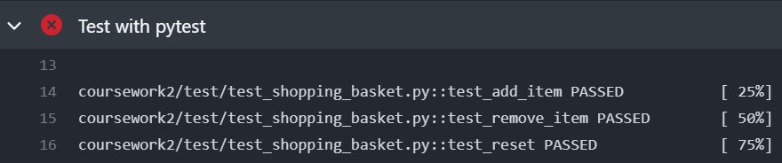
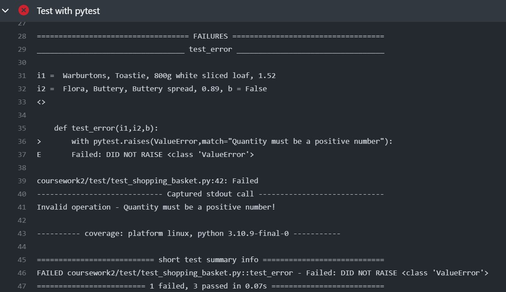
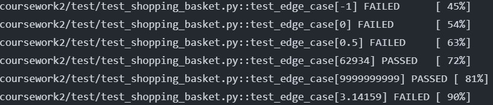
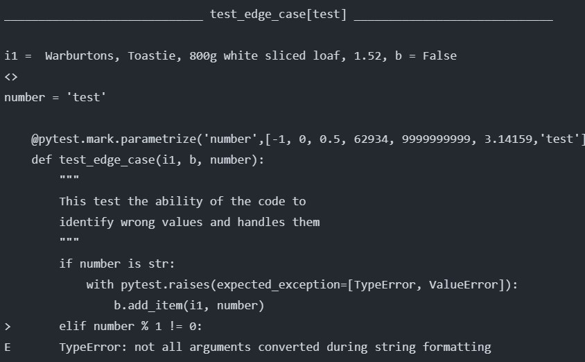

# Testing Shoping basket

## Defining Tests
To determine what senerio I should test for, I decided to brainstorm some user stories.   
### User Stories   
1. **As a customer**, **I want to** add item ,**so that I can** put all item I want in the basket   

2. **As a customer**, **I want to** remove item, **so that I can** ensure only items I want is in the basket  

3. **As a customer**, **I want to** see the description of an item in the basket, **so that I can** check if I have the right item.   

4. **As a customer**, **I want to** see list of item, **so that I can** check I am not buying too much

5. **As a customer**, **I want to** see the total price of item in basket, **so that I can** check that I am not over spending.

6. **As a customer**, **I want to** reset the basket, **so that I can** prepare for the next shopping trip.   

7. **As a customer**, **I want to** get a warning when I entered a wrong input, **so that I can** find the mistake I made   

With these 7 user stories, I have decided to define my test based on these stories.
Some of these stories are similar, for example number 1 and 2, it would be a good place to use an fixture to make the testing process simpler. 

### Given-When-That
**Given** item entered is valid, **When** item is added to basket, and **When** item is removed from basket, and **When** item is updated, **That** the basket is not empty, and **That** the total is correct   
This is the combinition of stories 1,2 and 5   
**Given** the basket is filled with item, **When** the basket is reset, **That** the basket becomes empty, and **That** the total cost is 0
This stems from story 6   
**Given** item entered is valid, **When** an negative number is entered, **That** the basket returens an exception
This stems from the user story 7
## Writing and Running Test
I have written 3 relatively simple test that all ran successfully
 
However, for the 4th test, which test for a ValueError the code should raise, the test was failed
 
### Using Fixture
I noticed in my test that the items and baskets are defined repetitively. Therefore, I have created a fixture so part of the code are reused easily.   
The fixture pre-defines the item i1 and basket so that I do not have to define those 2 repetitively.
### Paramitised Test
I have tried to run a parametised test and it ran
   
 
I got an error from one of the test but the pytest.raise decorator did not catch the error

